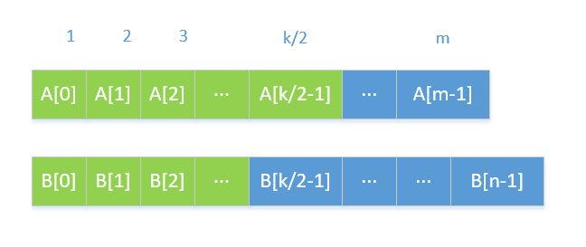

##4. Median of Two Sorted Arrays

###Hard

There are two sorted arrays nums1 and nums2 of size m and n respectively.

Find the median of the two sorted arrays. The overall run time complexity should be O(log (m+n)).

You may assume nums1 and nums2 cannot be both empty.

Example 1:

nums1 = [1, 3]
nums2 = [2]

The median is 2.0
Example 2:

nums1 = [1, 2]
nums2 = [3, 4]

The median is (2 + 3)/2 = 2.5

Идеи решения проблем:
  Этот вопрос относится к уровню _сложный_ и является относительно сложным. Вот пять решений от простого к сложному.

####Решение 1: объединить два массива, чтобы найти медиану

 На первый взгляд этой проблемы у нас будет очень интуитивное решение проблемы насилия. Оба массива упорядочены от 
малого к большому, что требует общей медианы. Вам нужно только объединить два массива, чтобы синтезировать растущий 
массив, и вы можете непосредственно найти средний элемент.

  Временная сложность объединения двух массивов составляет O (m + n), а поиск медианы в упорядоченном массиве 
занимает всего O (1) времени, поэтому общая сложность времени составляет O (m + n), и это также требует 
дополнительный массив длиной m + n, поэтому сложность пространства также составляет O (m + n).

####Решение 2: улучшенное слияние

  Начиная с метода грубой силы, мы на самом деле можем обнаружить, что наша цель - только найти медиану, 
поэтому нет необходимости объединять весь массив, нам нужно только объединить, чтобы получить медиану. 
То есть длина первоначально объединенного массива должна составлять m + n, но до тех пор, пока он объединен 
до половины длины, медиана может быть найдена.

  Для медианы, если len (len = m + n) нечетно, то len / 2 + 1-е число после слияния является медианой, а если 
len четное, то среднее должно быть средним из двух средних чисел после слияния , Который является средним из 
двух чисел len / 2th number и len / 2 + 1th number. Обратите внимание, что здесь речь идет о числе, 
индекс 0 - это первое число, обратите внимание при написании кода.

  Таким образом, идея решения 2 состоит в том, чтобы объединять только до тех пор, пока медиана не будет найдена, 
и весь объединенный массив не нужно сохранять. Вам нужно только поддерживать две переменные во время процесса цикла, 
len / 2-е число и первое Лен / 2 + 1 номер.

  Поскольку объединяется только половина, временная сложность составляет O (len / 2), 
которая по-прежнему равна O (m + n), но сложность пространства уменьшается до O (1).

####Решение 3: найдите k-е наименьшее число

  Очевидно, что хотя первое и второе решения относительно легко понять, мы видим, что сложность фактического 
времени не соответствует требованиям проблемы. Проблема требует, чтобы сложность времени была на уровне журнала. 
В общем, чтобы быть сложностью времени журнала, она связана либо с двоичным деревом, либо с двоичным поиском. 
Структура данных здесь представляет собой массив, поэтому мы должны рассмотреть некоторые аспекты бинарного поиска.

  Здесь мы даем третий способ решения проблемы: медиана упорядоченного массива на самом деле представляет 
собой len / 2-е число в массиве (четное число является средним из двух чисел). Таким образом, нахождение медианы 
может быть преобразовано в нахождение k-го наименьшего числа в массиве. Поскольку мы знаем, как найти k-е 
наименьшее число, то для нечетной длины мы непосредственно находим число len / 2 + 1-й наименьший является медианой,
а если число четное, мы находим len / 2th и len / 2 + 1 маленькие числа усредняются.

  Поэтому наша задача состоит в том, как найти k-е наименьшее число в двух упорядоченных массивах .

  Вот лучший способ: чтобы найти k-е наименьшее число, мы сравним k / 2-е число в двух массивах, которое 
должно выполнить nums1 [k / 2-1] и nums2 [k / 2-1] Для сравнения, если оно мало, то оно и число перед ним не 
будет k-м наименьшим числом, его можно исключить , повторите этот процесс в оставшихся данных, чтобы найти.

  На самом деле эту истину нетрудно понять: как показано на следующем рисунке, если nums1 [k / 2-1] меньше 
nums2 [k / 2-1], то число перед ним меньше nums1 [k / 2-1] Если предположить, что число перед nums2 [k / 2-1] 
в массиве nums2 также меньше его (фактически, оно не обязательно меньше), то все числа, меньшие чем nums1 [k / 2-1], 
имеют в общей сложности k / 2 1 + k / 2-1, то есть k-2, то есть nums1 [k / 2-1] может быть не более k-1-го и не может 
быть kth , поэтому он и число перед ним Может быть исключен.

  И наоборот, если nums1 [k / 2-1] больше чем nums2 [k / 2-1], вы можете исключить nums2 [k / 2-1] и число перед ним. 
Если два числа равны, то любое Просто выберите массив для исключения, но все равно исключите k / 2 числа.

  Следовательно, наше третье решение состоит в том, чтобы каждый раз брать для сравнения элемент с половиной k, 
и элементы k / 2 и ранее в относительно небольшом массиве можно исключить, а затем продолжать находить kth 
в оставшемся массиве. Небольшие элементы (примечание: поскольку k / 2 элемента были исключены, значение k должно 
быть вычтено из числа исключенных элементов).

  Очевидно, что это повторяющийся процесс, поэтому он может быть решен с помощью рекурсии. Здесь следует обратить 
внимание на конечное условие рекурсии и на проблему вне пределов массива . K / 2 необходимо сравнивать с длиной 
массива, в зависимости от того, что меньше. Кроме того, поскольку элементы k / 2 удаляются каждый раз, должен 
существовать массив, который становится пустым, или k станет 1, что является условием завершения. 
Подробнее см. В приведенном ниже коде.

  Наконец, давайте проанализируем сложность этого решения. В третьем решении мы удаляем k / 2 элементов в 
каждом цикле, поэтому временная сложность равна O (logk), а k равна половине m + n, поэтому временная сложность 
равна O ( log (m + n)), дополнительное пространство не используется, а сложность пространства равна O (1).